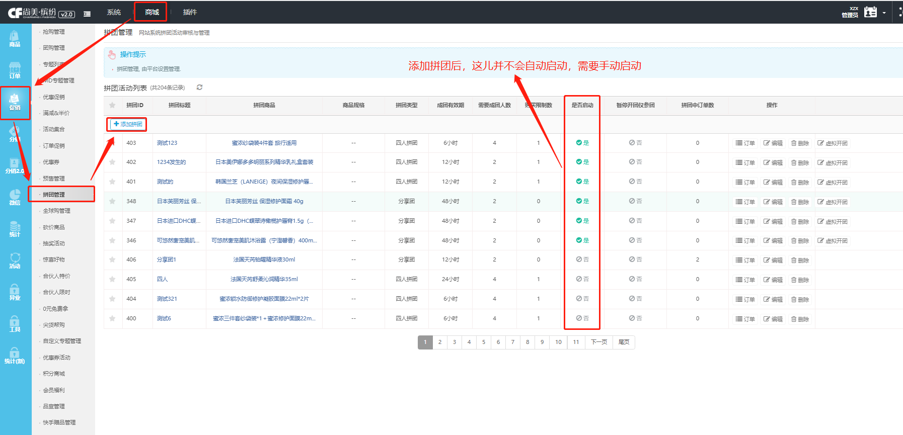
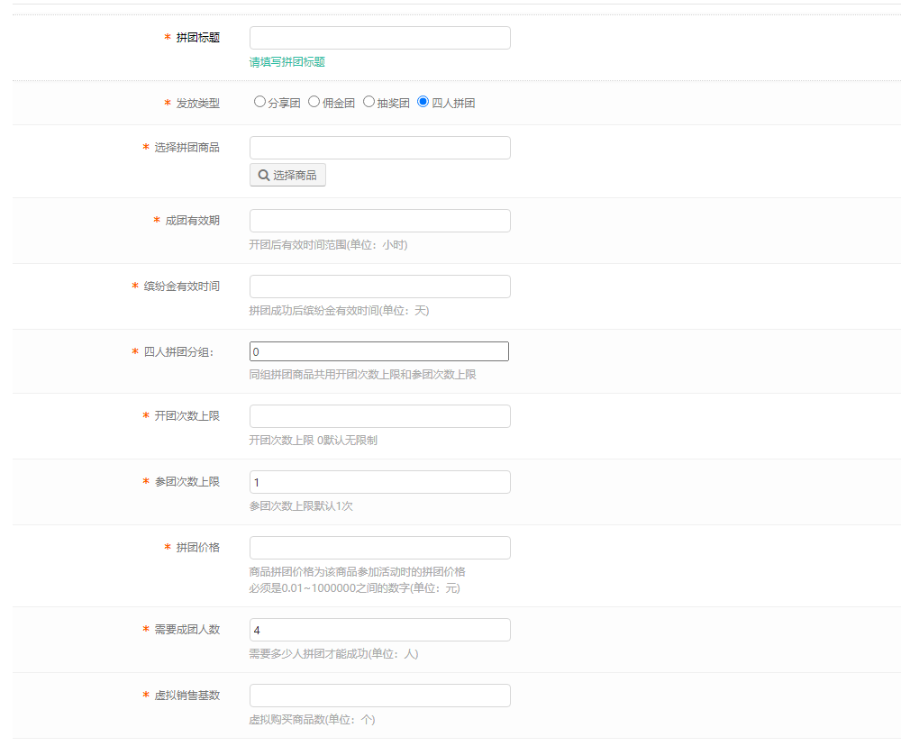
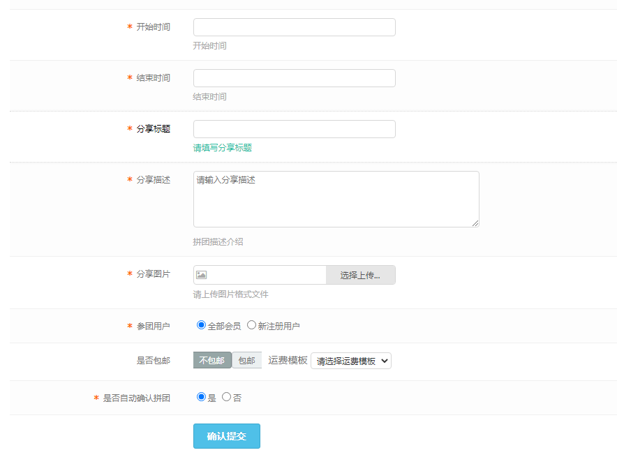
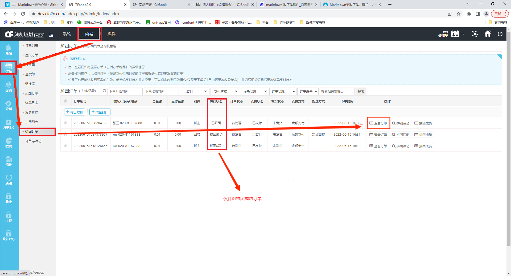
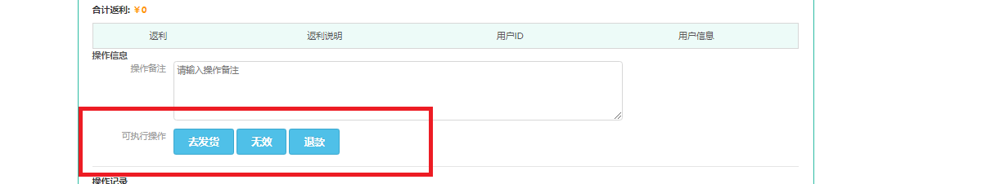

# 四人拼团（返缤纷金）

功能路径 **商城-促销-拼团管理 **

点击 **添加拼团**按钮，增加拼团活动

***

## 添加四人拼团（返缤纷金）

**拼团标题**：上一级拼团列表显示的拼团名字，标识符

**发放类型**：选择**四人拼团** ，这里的四人拼团选项就是拼团返缤纷金的选项

**选择拼团商品**：在商品库中，选择一款活动/品牌缤纷金商品作为拼团商品（	注意：返缤纷金的类型，取决于该商品属于活动/品牌缤纷金商品）【设置缤纷金商品地址（系统-设置-新版缤纷金设置）】

**成团有效期**：拼团订单的过期时间

**缤纷金有效时间**：返还缤纷金的有效时间，从拼团成功后的时间开始计算

**四人拼团分组**：把几个拼团活动商品整合成一个活动小组，同一活动小组的拼团共享开团次数和参团次数。相同数字的几个商品被视为一组。

**开团次数商品**：拼团发起者的最大发起次数

**参团次数上限**：拼团参与者的最大参与次数

**拼团价格**：商品在拼团活动里的价格

**需要成团人数**：拼团需要的成功人数

**虚拟销售基数**：四人拼团功能未展示已销售数量，可忽略

**开始时间**：拼团商品开团的时间，可提前几天添加，用户端会显示开团的开始时间

**结束时间**：拼团商品结束的时间。用户端会有倒计时，最大单位：天

**分享标题**：分享拼团时的标题

**分享描述**：分享拼团时的具体描述

**分享图片**：分享拼团时的图片

**参团用户**：默认全部会员，当选择新注册用户时，则老用户无法拼团

**是否包邮**：选择不包邮时，可在右边选择运费模板，为当前商品选择独立的运费规则

**是否自动确认拼团**：默认是，四人拼团不能选择否

### 注意

添加拼团后，未有拼团订单时，可对拼团设置进行更改，当已创建拼团订单后，将无法更改拼团设置

### 拼团成功 后台 退款功能

  

### 仅针对拼团成功的订单

### 点击查看订单进入(支持此操作时，会显示在操作信息里)

### 注意

1.收到货后14天后，解冻缤纷金