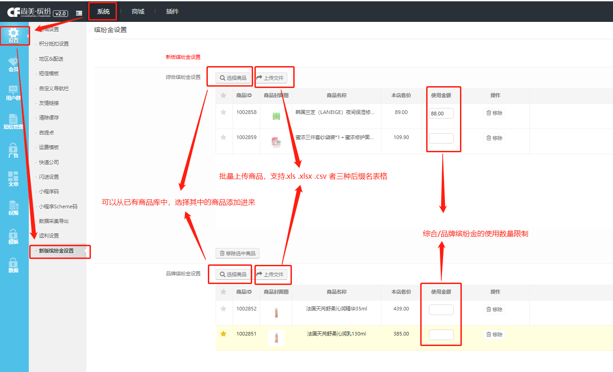

## 新版缤纷金

此处是批量给普通商品打上 **活动/品牌缤纷金标签  **,当用户存在对应缤纷金时，则可以使用对应缤纷金购买缤纷金商品

注：综合缤纷金 === 活动缤纷金

#### 批量添加活动/品牌缤纷金标签

点击 **选择商品**  可以从已有的商品库中，选择其中的普通商品，使其加上对应的标签

点击 **上传文件 ** 可以从 `.xls .xlsx .csv`这三中表格格式中，批量导入需要加入的商品

#### 活动/综合缤纷金使用比例

此处的 **使用比例**是指当前商品活动/品牌缤纷金使用比例

商品价格 * 使用比例 = 商品最大能使用的活动/品牌缤纷金数量

设置为0则表示  仅在拼团订单中显示

#### 注意

在点击底部  **确认提交** 按钮之后，上方选择的商品才会被添加上活动/品牌缤纷金标签